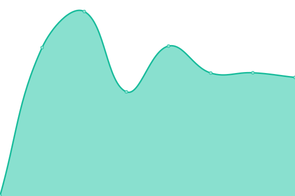

# [📈 Live Status](https://upptime.github.io/upptime): <!--live status--> **🟧 Partial outage**

This repository contains the open-source uptime monitor and status page for [Upptime](https://upptime.js.org), powered by [Upptime](https://github.com/upptime/upptime).

With [Upptime](https://upptime.js.org), you can get your own unlimited and free uptime monitor and status page, powered entirely by a GitHub repository. We use [Issues](https://github.com/upptime/upptime/issues) as incident reports, [Actions](https://github.com/ASchmidt1024/uptime/actions) as uptime monitors, and [Pages](https://upptime.github.io/upptime) for the status page.

<!--start: status pages-->
<!-- This summary is generated by Upptime (https://github.com/upptime/upptime) -->
<!-- Do not edit this manually, your changes will be overwritten -->
<!-- prettier-ignore -->
| URL | Status | History | Response Time | Uptime |
| --- | ------ | ------- | ------------- | ------ |
|  [alnatura.ch](https://www.alnatura.ch/) | 🟥 Down | [alnatura-ch.yml](https://github.com/ASchmidt1024/uptime-mgb/commits/HEAD/history/alnatura-ch.yml) | 

 1004ms
     
 | 

<a href="https://ASchmidt1024.github.io/uptime-mgb/history/alnatura-ch">99.94%</a>
    

|  [nature.ch](https://nature.ch/) | 🟥 Down | [nature-ch.yml](https://github.com/ASchmidt1024/uptime-mgb/commits/HEAD/history/nature-ch.yml) | 

 1636ms
     
 | 

<a href="https://ASchmidt1024.github.io/uptime-mgb/history/nature-ch">99.96%</a>
    

|  [kaimug.ch](https://www.kaimug.ch/) | 🟩 Up | [kaimug-ch.yml](https://github.com/ASchmidt1024/uptime-mgb/commits/HEAD/history/kaimug-ch.yml) | 

 869ms
     
 | 

<a href="https://ASchmidt1024.github.io/uptime-mgb/history/kaimug-ch">100.00%</a>
    

|  [hitzberger.ch](https://www.hitzberger.ch/) | 🟩 Up | [hitzberger-ch.yml](https://github.com/ASchmidt1024/uptime-mgb/commits/HEAD/history/hitzberger-ch.yml) | 

 866ms
     
 | 

<a href="https://ASchmidt1024.github.io/uptime-mgb/history/hitzberger-ch">100.00%</a>
    

|  [buelach-sued.ch](https://www.buelach-sued.ch/) | 🟩 Up | [buelach-sued-ch.yml](https://github.com/ASchmidt1024/uptime-mgb/commits/HEAD/history/buelach-sued-ch.yml) | 

 894ms
     
 | 

<a href="https://ASchmidt1024.github.io/uptime-mgb/history/buelach-sued-ch">100.00%</a>
    

|  [zueriseecenter.ch](https://www.zueriseecenter.ch/) | 🟩 Up | [zueriseecenter-ch.yml](https://github.com/ASchmidt1024/uptime-mgb/commits/HEAD/history/zueriseecenter-ch.yml) | 

 689ms
     
 | 

<a href="https://ASchmidt1024.github.io/uptime-mgb/history/zueriseecenter-ch">100.00%</a>
    

|  [migros-city.ch](https://www.migros-city.ch/) | 🟩 Up | [migros-city-ch.yml](https://github.com/ASchmidt1024/uptime-mgb/commits/HEAD/history/migros-city-ch.yml) | 

 753ms
     
 | 

<a href="https://ASchmidt1024.github.io/uptime-mgb/history/migros-city-ch">100.00%</a>
    

|  [neumarktaltstetten.ch](https://www.neumarktaltstetten.ch/) | 🟩 Up | [neumarktaltstetten-ch.yml](https://github.com/ASchmidt1024/uptime-mgb/commits/HEAD/history/neumarktaltstetten-ch.yml) | 

 722ms
     
 | 

<a href="https://ASchmidt1024.github.io/uptime-mgb/history/neumarktaltstetten-ch">100.00%</a>
    

|  [stage-one.ch](https://www.stage-one.ch/) | 🟩 Up | [stage-one-ch.yml](https://github.com/ASchmidt1024/uptime-mgb/commits/HEAD/history/stage-one-ch.yml) | 

 761ms
     
 | 

<a href="https://ASchmidt1024.github.io/uptime-mgb/history/stage-one-ch">100.00%</a>
    

|  [orangergarten.ch](https://www.orangergarten.ch/) | 🟩 Up | [orangergarten-ch.yml](https://github.com/ASchmidt1024/uptime-mgb/commits/HEAD/history/orangergarten-ch.yml) | 

 737ms
     
 | 

<a href="https://ASchmidt1024.github.io/uptime-mgb/history/orangergarten-ch">100.00%</a>
    

|  [parkimgruene.ch](https://www.parkimgruene.ch/) | 🟩 Up | [parkimgruene-ch.yml](https://github.com/ASchmidt1024/uptime-mgb/commits/HEAD/history/parkimgruene-ch.yml) | 

 751ms
     
 | 

<a href="https://ASchmidt1024.github.io/uptime-mgb/history/parkimgruene-ch">100.00%</a>
    

|  [betriebsrestaurants-migros.ch](https://www.betriebsrestaurants-migros.ch/) | 🟩 Up | [betriebsrestaurants-migros-ch.yml](https://github.com/ASchmidt1024/uptime-mgb/commits/HEAD/history/betriebsrestaurants-migros-ch.yml) | 

 771ms
     
 | 

<a href="https://ASchmidt1024.github.io/uptime-mgb/history/betriebsrestaurants-migros-ch">100.00%</a>
    

|  [miduca.ch](https://www.miduca.ch/) | 🟩 Up | [miduca-ch.yml](https://github.com/ASchmidt1024/uptime-mgb/commits/HEAD/history/miduca-ch.yml) | 

 650ms
     
 | 

<a href="https://ASchmidt1024.github.io/uptime-mgb/history/miduca-ch">100.00%</a>
    

|  [m4music.ch](https://www.m4music.ch/) | 🟩 Up | [m4music-ch.yml](https://github.com/ASchmidt1024/uptime-mgb/commits/HEAD/history/m4music-ch.yml) | 

 1118ms
     
 | 

<a href="https://ASchmidt1024.github.io/uptime-mgb/history/m4music-ch">100.00%</a>
    

|  [migros-engagement.ch](https://www.migros-engagement.ch/) | 🟩 Up | [migros-engagement-ch.yml](https://github.com/ASchmidt1024/uptime-mgb/commits/HEAD/history/migros-engagement-ch.yml) | 

 1598ms
     
 | 

<a href="https://ASchmidt1024.github.io/uptime-mgb/history/migros-engagement-ch">100.00%</a>
    

|  [sparx-space.ch](https://www.sparx-space.ch/) | 🟩 Up | [sparx-space-ch.yml](https://github.com/ASchmidt1024/uptime-mgb/commits/HEAD/history/sparx-space-ch.yml) | 

 563ms
     
 | 

<a href="https://ASchmidt1024.github.io/uptime-mgb/history/sparx-space-ch">100.00%</a>
    

|  [migrosindustrie.ch](https://www.migrosindustrie.ch/) | 🟩 Up | [migrosindustrie-ch.yml](https://github.com/ASchmidt1024/uptime-mgb/commits/HEAD/history/migrosindustrie-ch.yml) | 

 1503ms
     
 | 

<a href="https://ASchmidt1024.github.io/uptime-mgb/history/migrosindustrie-ch">100.00%</a>
    

|  [maker-space.com](https://www.maker-space.com/) | 🟩 Up | [maker-space-com.yml](https://github.com/ASchmidt1024/uptime-mgb/commits/HEAD/history/maker-space-com.yml) | 

 764ms
     
 | 

<a href="https://ASchmidt1024.github.io/uptime-mgb/history/maker-space-com">100.00%</a>
    

|  [logistiktransport.ch](http://www.logistiktransport.ch/) | 🟩 Up | [logistiktransport-ch.yml](https://github.com/ASchmidt1024/uptime-mgb/commits/HEAD/history/logistiktransport-ch.yml) | 

 799ms
     
 | 

<a href="https://ASchmidt1024.github.io/uptime-mgb/history/logistiktransport-ch">100.00%</a>
    

|  [eatery.ch](https://www.eatery.ch/) | 🟩 Up | [eatery-ch.yml](https://github.com/ASchmidt1024/uptime-mgb/commits/HEAD/history/eatery-ch.yml) | 

 650ms
     
 | 

<a href="https://ASchmidt1024.github.io/uptime-mgb/history/eatery-ch">100.00%</a>
    

<!--end: status pages-->

[**Visit our status website →**](https://upptime.github.io/upptime)

## 📄 License

- Powered by: [Upptime](https://github.com/upptime/upptime)
- Code: [MIT](./LICENSE) © [Upptime](https://upptime.js.org)
- Data in the `./history` directory: [Open Database License](https://opendatacommons.org/licenses/odbl/1-0/)
